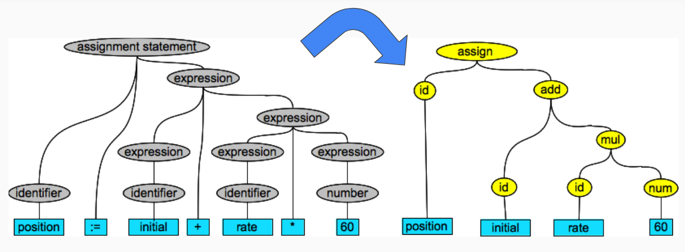

# Problema: se necesita de un árbol de sintaxis abstracta para el analizador semántico
## Duda: cómo construir un AST a partir del analizador sintáctico
### Fecha: 11 de noviembre de 2024
### Resolución:
Convertir el Parse Tree de manera que se crean nodos AST especializados. Se realiza un recorrido en profundidad del árbol Parse y para cada nodo relevante para la semántica, se crea un nodo AST con los hijos del nodo que sean relevantes para la semántica.
### Ilustraciones:

(UseTheSource, s. f.).
### Ayudas:
- [(OpenAI, 2024)](https://chatgpt.com/share/6731a68e-358c-8013-938c-5c8e9c5eaf8f)
- [Nodos](https://github.com/John-Ling/Pseudocode-Compiler) (Ling, 2024)

### Referencias:
- Ling, J. (2024). *John-Ling/Pseudocode-Compiler: Basic compiler that turns pseudocode into Python.* GitHub. https://github.com/John-Ling/Pseudocode-Compiler
- OpenAI. (2024). ChatGPT (GPT-4o) [Modelo de lenguaje de gran tamaño]. https://chat.openai.com/chat
- UseTheSource. (s. f.). *Abstract Syntax Tree | The Rascal Meta Programming Language.* The Rascal Meta Programming Language. https://www.rascal-mpl.org/docs/Rascalopedia/AbstractSyntaxTree/
